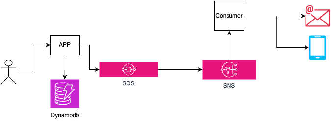
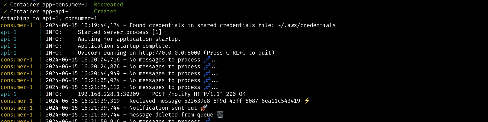
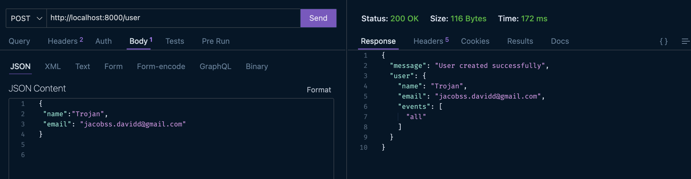
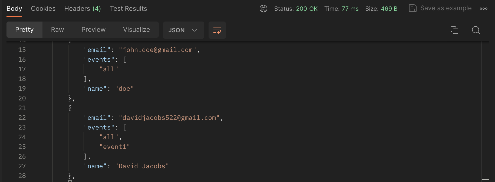
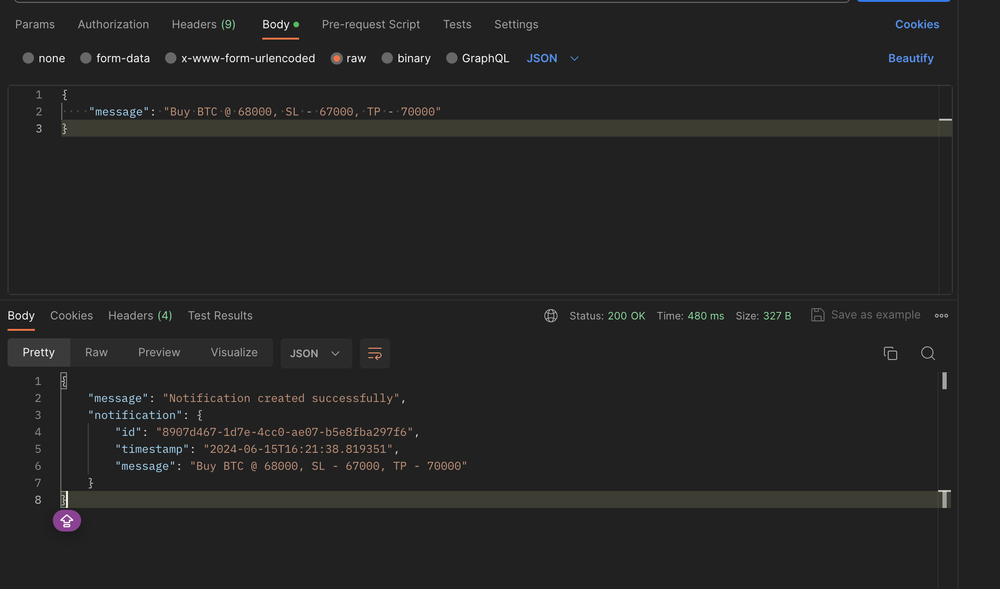
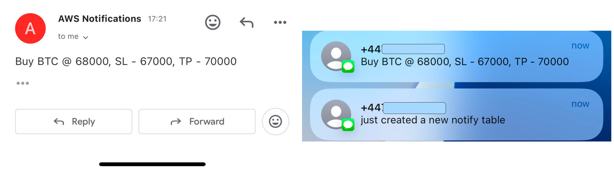

## Simple Notifier Using FastAPI & AWS Services.

A simple application to build a near real-time notifier using AWS services; SQS, SNS, and DynamoDB. This application is designed to send notifications/messages to various subscribed endpoints in ~1sec, ensuring notifications are processed and delivered instantly with minimal latency.




### Features

- **Near Real-Time Notifications**: Delivers messages to endpoints almost instantaneously.
- **AWS Integration**: Utilizes AWS SQS for message queuing, SNS for message distribution, and DynamoDB for storage.
- **Scalable**: Designed to handle a large number of notifications with minimal latency.
- **Reliable**: Ensures messages are reliably processed and delivered to the subscribers.


### Prerequisites

Before you start, ensure you have the following:

- AWS credentials configured locally in `~/.aws` directory.
- AWS resources provisioned(**SQS, SNS & DYNAMODB**)
- Docker & installed on your machine.

### Running The Application
To run the application you can do that by using docker compose ``` docker-compose up --build```.
It starts up 2 services, the **FastAPI app** and the **consumer** as seen below.




You can create users in DynamoDB and also list users from DynamoDB.





Go ahead to test it by sending a message as seen below.



Then you can see the message(s) deliverd instantly to the subcribed endpoints.



### Note
- To run the container, bind it to your local AWS configuration directory. This allows the container to access your AWS credentials.
e.g ```docker run --rm -v ~/.aws:/root/.aws```.

- The terraform files for the required AWS resources are avaliabe in ```aws_reources``` directory. You can provision the resources using **Terraform** or via the **console**.

